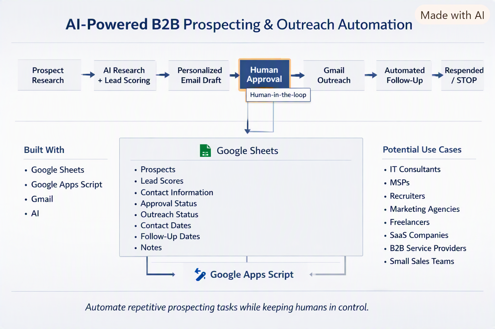

# AI-Powered B2B Prospecting & Outreach Automation

An AI-assisted B2B prospecting and outreach automation system built with Google Sheets, Google Apps Script, Gmail, and AI.

## What It Does

This system automates many of the repetitive parts of B2B prospecting while keeping a human involved before outreach is sent.

The system can:

- Track prospects
- Score potential leads
- Assist with prospect research
- Generate personalized outreach emails
- Require human approval before sending
- Send emails through Gmail
- Schedule automated follow-ups
- Detect prospect replies
- Automatically stop follow-ups when a prospect responds
- Track outreach status
- Apply daily sending limits

## How It Works

Research → AI Analysis → Personalized Outreach → Human Approval → Gmail → Follow-Up → Reply Detection → Stop

## Architecture

## Built With

- Google Sheets
- Google Apps Script
- Gmail
- AI

## Potential Use Cases

This type of automation can be adapted by:

- IT consultants
- MSPs
- Recruiters
- Marketing agencies
- Freelancers
- SaaS companies
- B2B service providers
- Small sales teams
- Professional services organizations

## Why I Built It

I originally built this system to support B2B prospecting for CCaaS and customer experience engineering services.

The architecture is intentionally flexible so it can be adapted for other B2B prospecting and outreach use cases.

## Human-in-the-Loop

AI assists with research, lead scoring, and drafting.

A human must review and approve prospects before the initial outreach email is sent.

## Safety

This project is designed for controlled, human-reviewed outreach.

It should not be used for indiscriminate bulk emailing or spam.

Do not commit passwords, API keys, OAuth tokens, or private prospect information to the repository.
